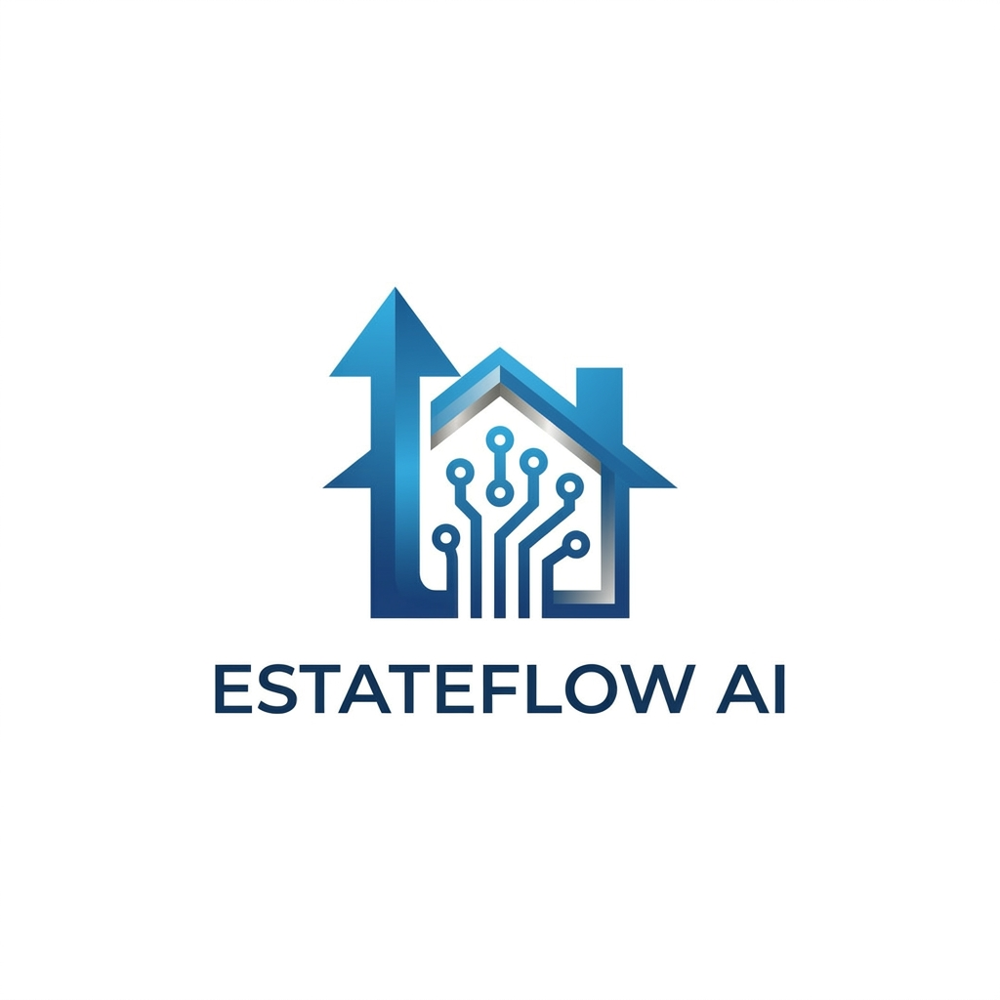

# Brand Identity Guidelines: EstateFlow AI

## 1. The "Trustworthy Tech" Color Palette
To maintain a professional look across all digital assets, EstateFlow AI uses a mix of deep anchors and vibrant accents to balance the "bricks and mortar" stability of real estate with the "glowing" innovation of AI.

| Role | Color | HEX Code | Psychological Impact |
| :--- | :--- | :--- | :--- |
| **Primary (Anchor)** | **Midnight Navy** | `#0A192F` | Conveys authority, depth, and corporate trust. |
| **Primary (Action)** | **Electric Blue** | `#007BFF` | Represents the "Flow," AI connectivity, and digital energy. |
| **Accent (Data)** | **Cyber Cyan** | `#00F2FE` | Used for highlighting analytics and "glowing" UI elements. |
| **Neutral (Clean)** | **Steel White** | `#F8FAFC` | Provides a crisp, modern background for reports and websites. |
| **Highlight** | **Property Gold** | `#D4AF37` | Use sparingly for premium service tiers or call-to-action buttons. |

---

## 2. Typography Strategy

### **Headline Font: Montserrat (Bold / Extra Bold)**
* **Characteristics:** A geometric, clean sans-serif that feels structural, modern, and architectural.
* **Usage:** Use for logo text, page/video titles, and major headings.

### **Body Font: Inter (Regular / Medium)**
* **Characteristics:** Highly legible on all screens, crisp and approachable.
* **Usage:** Use for proposals, emails, and social media captions.

---

## 3. Logo Application Rules

### **The "Main" Logo**
* **Symbol:** "House + Circuit + Arrow" symbol using the Electric Blue gradient.
* **Text:** "ESTATEFLOW AI" set in Montserrat Bold, colored in Midnight Navy.

### **The "Dark Mode" Logo**
* **Symbol:** Utilizing a slight Cyber Cyan glow effect.
* **Text:** Montserrat Bold, colored in Steel White.

---

## 4. Brand Voice: The Empowerment Architect

### **Persona: The Coach**
* **Role:** A guide who demystifies AI, making it a reachable tool for agents rather than a mystery.
* **Perspective:** Encouraging, strategic, and focused on the agent’s growth and success.

### **Tone Characteristics**
* **Innovative:** Highlighting "new ways" to solve old problems.
* **Trustworthy:** High-tech solutions grounded in reliability.
* **Efficient:** Focusing on tools that cut out "busy work."

### **Language Style: Simple & Semi-Formal**
* **Structure:** Clear, punchy sentences.
* **Vocabulary:** Professional terms (e.g., "Lead Management") without technical jargon.

### **The "High-Tech but not Complicated" Filter**
* **Yes:** "Automated lead nurturing" | **No:** "Autonomous multi-channel neural sequencing."
* **Yes:** "Efficiency" | **No:** "Hyper-optimized throughput."

---

## 5. Social Media Post Logo Standards

### Canonical Logo Reference

Full logo — used as profile picture on Facebook and YouTube (canonical color and proportion reference):



Symbol-only overlay already in use (Facebook cover photo):


---

### 5.1 Assets

| Asset | Description | Status |
| :--- | :--- | :--- |
| `symbol-main.svg` | Symbol only (no text), Electric Blue gradient, vector — scales to any size without pixelation | ✅ Available in `assets/` |
| `symbol-main.png` | Raster export of above at 600 px wide, transparent background | ✅ Available in `assets/` |
| `symbol-dark.svg` | Symbol only (no text), Cyber Cyan color shift, vector | ✅ Available in `assets/` — note: no glow effect; add Cyber Cyan glow in Canva/Figma for a polished variant |
| `symbol-dark.png` | Raster export of above at 600 px wide, transparent background | ✅ Available in `assets/` |

Generated using `tools/extract_logo_symbol.py` from the vector source `test_image.svg`. Requires `pip install resvg-python`.

To regenerate:
- `python tools/extract_logo_symbol.py` — main (Electric Blue)
- `python tools/extract_logo_symbol.py --dark-mode` — dark (Cyber Cyan)
- `python tools/extract_logo_symbol.py --png-width 1200` — wider PNG export

---

### 5.2 Which Version to Use on Posts

Use the **symbol-only** PNG (no "ESTATEFLOW AI" text). Choose the variant based on the post background:

| Post Background | File to Use |
| :--- | :--- |
| Light / white / Steel White | `symbol-main.png` — Electric Blue gradient |
| Dark / Midnight Navy / photo-heavy | `symbol-dark.png` — Cyber Cyan glow |

Never place the main symbol over a dark background, or the dark-mode symbol over a light background.

---

### 5.3 Watermark Opacity

Set the symbol to **75% opacity** when overlaying it on post images. This keeps the logo visible without overpowering the post content. Never go below 60% (too faint) or use 100% (too dominant).

---

### 5.4 Clear Space Rule

Maintain a minimum clear space of **1× the symbol's height** on all sides of the symbol. No text, other graphics, or post elements should enter this zone.

```
        ↕ 1× symbol height (clear space)
  ←→ [   symbol   ] ←→
        ↕ 1× symbol height (clear space)
```

This applies both to the watermark placement on posts and to any other use of the logo or symbol.

---

### 5.5 Placement

* **Position:** Bottom-right corner of every post image.
* **Padding:** Minimum 24 px from the right edge and 24 px from the bottom edge (in addition to the clear space zone above).

---

### 5.6 Sizing by Platform and Post Type

**Facebook**
| Post Type | Canvas Size | Symbol Width |
| :--- | :--- | :--- |
| Square post | 1080 × 1080 px | 120 px |
| Landscape / link preview | 1200 × 630 px | 140 px |

**Instagram**
| Post Type | Canvas Size | Symbol Width |
| :--- | :--- | :--- |
| Portrait post (primary format) | 1080 × 1350 px | 120 px |
| Square post | 1080 × 1080 px | 120 px |
| Story / Reel cover | 1080 × 1920 px | 100 px |

**YouTube**
| Asset Type | Canvas Size | Symbol Width |
| :--- | :--- | :--- |
| Video thumbnail | 1280 × 720 px | 130 px |
| Channel banner | 2560 × 1440 px | 200 px |

Scale height proportionally. Never stretch or distort the symbol.

---

### 5.7 YouTube Profile Picture Note

> **⚠️ Action required:** YouTube displays profile pictures as a **circle**, which clips the corners of the current square logo. The full logo (`yt_pp.png`) may show poorly — consider creating a tighter, centered crop of just the symbol (with padding) as a dedicated circular-safe YouTube profile picture.

---

### 5.8 Rules

* Always use **PNG with transparent background** — never JPEG for the logo asset.
* Do not resize the symbol below **80 px wide** — circuit detail becomes illegible.
* Do not add drop shadows, extra filters, or color changes beyond the two approved variants.
* Do not overlap the symbol with faces, property addresses, or key text in the post.
* `fb_pp.png` and `yt_pp.png` must remain visually identical — if one is updated, update both.

---

## 6. Official Tagline

**"Your Partner in AI-Powered Real Estate Success."**

* Use this exact wording — do not paraphrase or shorten it.
* Always include the period at the end.
* Appears on the Facebook cover photo and may be used in post captions, email signatures, and marketing materials.
* **Placement in copy:** Can follow the brand name ("EstateFlow AI — Your Partner in AI-Powered Real Estate Success.") or stand alone as a closing line.
* **Do not use** as a hashtag or alter the casing (it is sentence case, not title case).

---

## 7. Email Signature Standards

### 7.1 Logo in Email

* Use the **full logo** (`fb_pp.png`) — symbol + "ESTATEFLOW AI" text.
* Display width: **160 px** (height scales proportionally).
* Place the logo **above** the agent's name and contact details, or to the left as a side block.
* Use the **main (light background) variant** — email clients default to white backgrounds.

### 7.2 Tagline in Email

* Include the official tagline beneath or beside the logo: *Your Partner in AI-Powered Real Estate Success.*
* Set in Inter Regular, same size as the contact details text.

### 7.3 Recommended Structure

```
[Full Logo — 160 px wide]
Your Partner in AI-Powered Real Estate Success.

[Agent Name] | [Title]
[Phone] | [Email]
[Website URL]
```

### 7.4 Rules

* Do not use a JPEG logo in email — PNG renders more crisply.
* Do not add decorative borders, background colors, or shadows around the logo in signatures.
* Keep the signature block under 200 px tall to avoid overwhelming email recipients.

---

## 8. Social Media Content Pillars

Every post should belong to one of these four themes. This keeps the feed structured and the brand voice consistent.

| Pillar | Theme | Example Post Topics |
| :--- | :--- | :--- |
| **Educate** | Demystify AI for agents | "What automated lead nurturing actually does", "5 tasks AI handles so you don't have to" |
| **Inspire** | Agent success and growth | Client win stories, before/after productivity stats, motivational market insights |
| **Inform** | Real estate market updates | Local market trends, interest rate impacts, housing data visualized |
| **Engage** | Community and interaction | Polls ("Biggest time-waster in your week?"), questions, behind-the-scenes |

**Posting balance (suggested):** 40% Educate · 25% Inspire · 25% Inform · 10% Engage.

Each post caption should reflect the Brand Voice filter from Section 4 — clear, punchy, no technical jargon.

---

## 9. Brand Misuse — Do Not

### Logo

* **Do not** rotate, skew, or flip the logo or symbol.
* **Do not** change the logo colors — use only the two approved variants (main and dark mode).
* **Do not** add drop shadows, glows, or outlines not part of the approved dark mode treatment.
* **Do not** place the logo on a patterned or visually busy background without using the symbol overlay treatment.
* **Do not** stretch or distort the logo — always scale proportionally.
* **Do not** use the "ESTATEFLOW AI" text as a standalone wordmark separated from the symbol.

### Colors

* **Do not** substitute similar colors (e.g., a generic blue instead of Electric Blue `#007BFF`).
* **Do not** use Property Gold (`#D4AF37`) as a primary or background color — it is a highlight only.

### Typography

* **Do not** use fonts other than Montserrat (headlines) and Inter (body).
* **Do not** use decorative, script, or condensed font variants.

### Tone

* **Do not** use technical jargon (see Section 4 filter examples).
* **Do not** use aggressive sales language ("Act now!", "Limited time!") — it conflicts with the Trustworthy tone.

---

## 10. Hashtag Strategy

### 10.1 Brand Hashtag (Always Use)

Include **#EstateFlowAI** on every post across Facebook and Instagram. This builds a searchable archive of all brand content over time.

### 10.2 Pillar Hashtags (Use 2–3 per post, matching the content pillar)

| Pillar | Hashtags |
| :--- | :--- |
| **Educate** | #AIRealEstate #RealEstateTech #PropTech #AgentTools |
| **Inspire** | #RealEstateSuccess #AgentLife #RealtorMotivation #ClosingDeals |
| **Inform** | #RealEstateMarket #HousingMarket #MarketUpdate #RealEstateTips |
| **Engage** | #RealEstateCommunity #AgentLife #AskAnAgent |

### 10.3 Volume Guidelines

| Platform | Total Hashtags per Post |
| :--- | :--- |
| Facebook | 3–5 (less is more — Facebook deprioritizes hashtag-heavy posts) |
| Instagram | 8–15 (Instagram rewards hashtag use for discovery) |

### 10.4 Placement

* **Facebook:** Place hashtags at the end of the caption, after the main text.
* **Instagram:** Place hashtags either at the end of the caption or in the first comment.

---

## 11. Standard Profile Bio Copy

Use the following text verbatim when setting up or updating profiles. Do not paraphrase.

### Facebook Page (255 character limit)

> AI-powered tools for real estate agents. Automate your lead management, close more deals, and grow your business — without the busy work. Your Partner in AI-Powered Real Estate Success.

### Instagram Bio (150 character limit)

> AI tools built for real estate agents 🏡
> Automate leads. Close more deals.
> estateflow.ai

*(Replace `estateflow.ai` with the actual website URL.)*

### YouTube Channel Description

> EstateFlow AI empowers real estate agents with AI-driven tools that automate lead management and cut out busy work — so you can focus on closing deals and growing your business.
>
> Subscribe for tips on AI in real estate, market insights, and strategies to help you work smarter.
>
> Your Partner in AI-Powered Real Estate Success.
